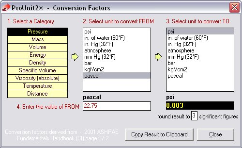



## ASHRAE Unit Conversion Factors

### Description

Conversion factors derived from 2001 ASHRAE Fundamentals Handbook (SI) page 37.2
 
### More Info
 

             |
---                |---
**Submitted On**   |2003-03-26 17:14:08
**By**             |[Al Moledina](https://github.com/Planet-Source-Code/PSCIndex/blob/master/ByAuthor/al-moledina.md)
**Level**          |Beginner
**User Rating**    |4.8 (24 globes from 5 users)
**Compatibility**  |VB 6\.0
**Category**       |[String Manipulation](https://github.com/Planet-Source-Code/PSCIndex/blob/master/ByCategory/string-manipulation__1-5.md)
**World**          |[Visual Basic](https://github.com/Planet-Source-Code/PSCIndex/blob/master/ByWorld/visual-basic.md)
**Archive File**   |[ASHRAE\_Uni1564993272003\.zip](https://github.com/Planet-Source-Code/al-moledina-ashrae-unit-conversion-factors__1-44283/archive/master.zip)

